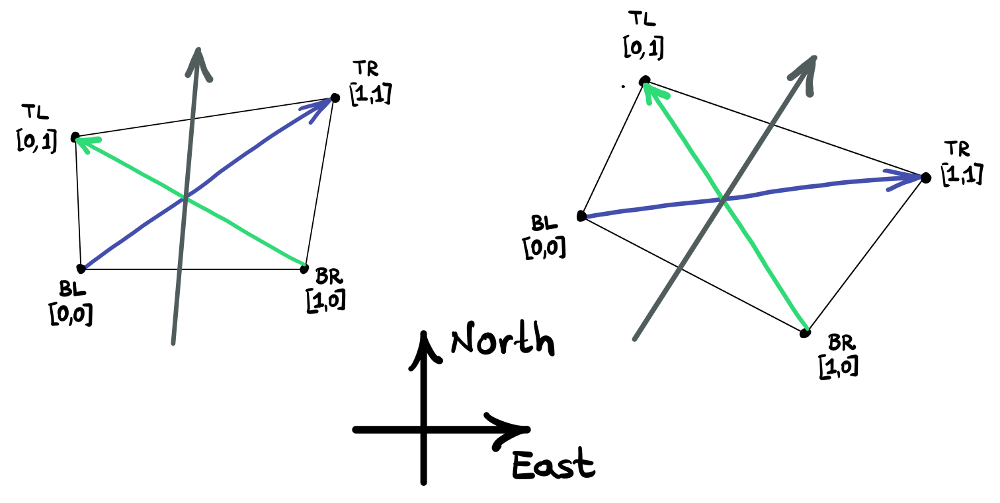

# Rotated grids and the angle calculation

For rotated horizontal grids, that is grids whose coordinates do not align with lines of constant latitude and longitude, we have to rotate the boundary conditions appropriately by the angle that the grid is rotated from the latitude-longitude coordinates, i.e., the angle formed by the curved grid's constant ``x`` coordinate compared to the true north.

**Issue:** Although horizontal grids supplied by users _do_ contain an `angle_dx` field, MOM6 by default ignores `angle_dx`  entirely and re-calculates the angles that correspond to each grid point.

**Solution:** To be consistent with MOM6's treatment of grid angles, when we rotate our boundary conditions, we implemented MOM6 angle calculation in a file called ``rotation.py`` and use the MOM6 method as the default for boundary regridding functions.

## Default Behavior
regional-mom6 by default computes the the angle of curved horizontal grids (``hgrids``) using the same algorithm as MOM6 does.

We explain below the implementation of MOM6 angle calculation in regional-mom6, which is the process by which regional-mom6 calculates the angle of curved horizontal grids (``hgrids``).

### Grid-cell angle of rotation algorithm
Steps 1 through 4 replicate the angle calculation in the interior ``t``-points, as done by MOM6 (see {meth}`rotation.mom6_angle_calculation_method <regional_mom6.rotation.mom6_angle_calculation_method>`). Step 5 describes how we can apply this algorithm to the boundary ``q``-points.

1. Determine the longitudinal extent of our domain, or periodic range of longitudes. For grids that go around the globe ``len_lon = 360``; for regional domains ``len_lon`` is provided by the ``hgrid``.
2. Find the four ``q``-points surrounding each ``t``-point in our grid. These four ``q`` points form a quadrilateral; let's denote them as top-left (TL), top-right (TR), bottom-left (BL), bottom-right (BR). We want to determine the average angle of rotation of this quadrilateral compared to the North-South direction. We ensure that the longitudes of the ``q`` points are within the range of ``len_lon`` around the ``t``-point itself via ({meth}`rotation.modulo_around_point <regional_mom6.rotation.modulo_around_point>`).
3. We convert the longitudes and latitudes to distances on the globe. For that, we ensure to scale the horizontal distances with the `cos(latitude)` factor. The latitude we use for the scaling factor is the average of the latitudes of all four ``q`` points.
4. To determine the average rotation of the quadrilateral we form the vectors of its two diagonals and then the vectorial sum of the diagonals. The angle that vector of the sum of the diagonals forms with the North-South direction is a good approximation for the average angle of the quadrilateral and thus this is the angle we associate with the ``t`` point. The diagram below shows two quadrilaterals: the left one is already oriented along longitude-latitude coordinates and therefore the sum of the diagonals is oriented along North-South direction; the one on the right is rotated by a negative acute angle compared to North-South.
   
   We compute the angle of the sum-of-diagonals vector with the North-South direction via `numpy.arctan2(x, y)`; note that `numpy.arctan2(x, y)` returns `atan(x/y)`. We ensure that we use a counter-clockwise convention for the angle and also convert the angel to degrees.
5. **Additional step for the grid boundary points**

   Since the boundaries for a regional MOM6 domain are `q` points and not on the `t` points, to calculate the angle for those boundary points we extend the grid by a bit; see the {meth}`rotation.create_expanded_hgrid <regional_mom6.rotation.create_expanded_hgrid>` method. Doing so, we can apply the method above since now there exist four `t`-points around each boundary `q` point that form a quadrilateral around the `q` points.

### Available options for angle-of-rotation for boundary points

1. **EXPAND_GRID**: Compute grid angle replicating MOM6 calculations. Calculate another boundary row/column points around the hgrid using simple difference techniques. Use the new points to calculate the angle at the boundaries. This works because we can now access the four points needed to calculate the angle, where previously at boundaries we would be missing at least two.
2. **GIVEN_ANGLE**: Do not calculate the grid angle but rather use the user-provided field in the horizontal grid called `angle_dx`.

### Enforce using the provided `angle_dx`

To enforce using the provided angles instead of the default algorithm, when calling the regridding methods {meth}`segment.regrid_velocity_tracers <regional_mom6.regional_mom6.segment.regrid_velocity_tracers>` and {meth}`segment.regrid_tides <regional_mom6.regional_mom6.segment.regrid_tides>`, set the optional keyword argument `rotational method = GIVEN_ANGLE`
