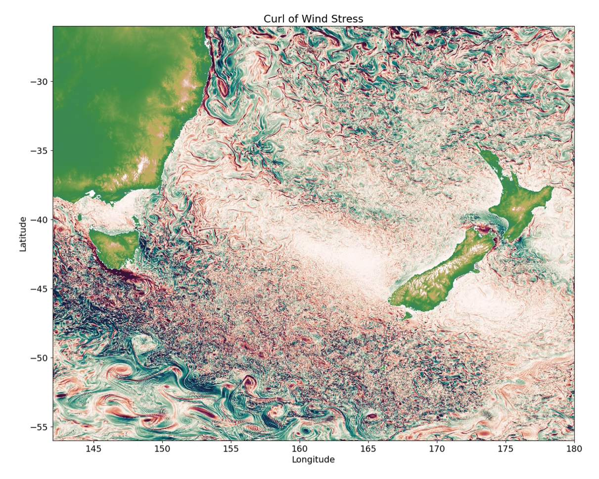

# Summary

Modular Ocean Model 6 (MOM6) is a widely-used general circulation open-source ocean-sea ice-ice shelf model developed mainly at the Geophysical Fluid Dynamics Laboratory (GFDL) [@Adcroft2019MOM6].
Among other improvements over its predecessor MOM5 (citation), MOM6 allows open boundary conditions and thus it is becoming popular also for regional ocean modeling studies (see, e.g., @gmd-16-6943-2023, @egusphere-2024-394).
However, setting up a regional configuration for MOM6 can be challenging and time consuming.
The `regional_mom6` python package automates the regridding, metadata encoding, grid generation and other miscellaneous steps, allowing models to be up and running more quickly.

The `regional_mom6` package takes raw files containing the initial condition, forcing, and bathymetry.
These inputs can be on the Arakawa A, B, or C grids, and the package performs the appropriate interpolation using `xESMF` [@xesmf] onto the C grid required by MOM6.
This base grid can either be constructed based on the user's desired resolution and choice of pre-configured options, or the user can provide their own horizontal or vertical grids.
In either case, the package then handles the coordinates, dimensions, metadata and encoding to ensure that the final input files are in formats expected by MOM6.
Additionally, the tricky case of a `seam' in the longitude of the raw input data (for instance at -180 and 180) is handled automatically, removing the need for any preprocessing of the data. 
The package also comes with pre-configured run directories, which can be automatically copied and modified to match the user's experiment.
Subsequently, a user need only copy a demo notebook, modify the longitude, latitude and resolution, and simply by running the notebook from start to finish will generate all they need for running a MOM6 experiment in their domain of interest.

This package is targeted at users with basic Python skills, and contains a documented tutorial that uses publicly available forcing and bathymetry datasets, namely, the GLORYS dataset for ocean forcing [@glorys], ERA5 for atmospheric forcing [@era5], and GEBCO for bathymetry [@gebco].
After completion of the example notebook, a complete set of input and configuration files will be generated for the example domain, requiring the user only to compile and run the MOM6 code on their computer.
Having the entire process run in a single, well documented Jupyter notebook dramatically reduces the barrier to entry for first time users, or those without a strong background reading FORTRAN source code of large models and manipulating netCDF files.
Besides making regional modelling with MOM6 more accessible, this package also serves to automate the generation of multiple experiments, saving time and improving reproducibility. 

Although `regional_mom6` was designed to automate the set-up as much as possible to aid first time users, it can also be used for more advanced configurations.
The modular design of the code means that users can use their own custom grids and set up boundaries one-by-one to accommodate more complex domain shapes.
As more advanced use cases emerge, users can contribute their grid generation functions as well as example configuration files and notebooks. 

{ width=80% }.

Figure \autoref{fig:example} is an example.

# Statement of need

The learning curve for setting up a regional ocean model can be quite steep.
In the case of MOM6, there are several tools scattered around github like those collected in ESMG's grid tools [@gridtools], as well as examples hardcoded for particular domains, input files and hardware.
However, there is no one-stop-shop to learn how to get a regional MOM6 model up and running, meaning that a newcomer must collect many disparate pieces of information from around the internet unless they are able to get help.
Other models have packages to aid in domain setup like `Pyroms` [@pyroms] for the Regional Oceanic Modelling System (ROMS; @shchepetkin2005regional) and `MITgcm_python` [@mitgcmpy] for the Massachusetts Institute of Technology General Circulation Model (MITgcm; @marshall1997finite).
With MOM6's growing user base for regional applications, there is a need for a platform that walks users through regional domain setup from from start to finish, and ideally helps with some of the time consuming parts of the process that ought to be automated.

A package also provides a standardised way of setting up regional models, allowing for more efficient troubleshooting. 
This is particularly important as the MOM6 boundary code is still under active development, meaning that an old example found Github may not work as intended with a newer executable.
Currently, it is difficult to discern what the best model settings are for a particular experiment with a given MOM6 executable. 
However, having different releases of a python package tied to releases of the MOM6 executable will help users avoid difficult to diagnose compatibility errors between the MOM6 codebase, input file formats and parameter files.

By having a shared set of tools that the community can work with and contribute to, this package also facilitates collaboration and knowledge sharing between different modelling groups. 
For instance, the Australian ocean modelling community built a set of tools known as the COSIMA Cookbook (cite github repo). Alongside the tools grew a set of contributed examples for postprocessing and analysis of model outputs.
In using a shared framework for setting up regional models, it will be easier to compare and contrast examples of different experiments as users seek techniques for generating their chosen domain.

A further advantage of such a package is for use in education. 
With the challenging -- but unimportant from an oceanographical point of view -- aspects of setting up a regional model handled by a Python package, simple MOM6 configurations could be set up and run in geophysical fluid dynamics courses, with students altering things like resolution or forcing, quickly re-running, and interpreting the changes.

# Acknowledgements

We thank the Consortium for Ocean–Sea Ice Modeling in Australia ([cosima.org.au](https://cosima.org.au)) for useful discussions during the development of this package.
N.C.C. acknowledges funding from the Australian Research Council under DECRA Fellowship DE210100749.
We would also like to acknowledge the code and notes by James Simkins, Andrew Ross, and Rob Cermak, which helped us to troubleshoot and improve the algorithms in our package.

# References
